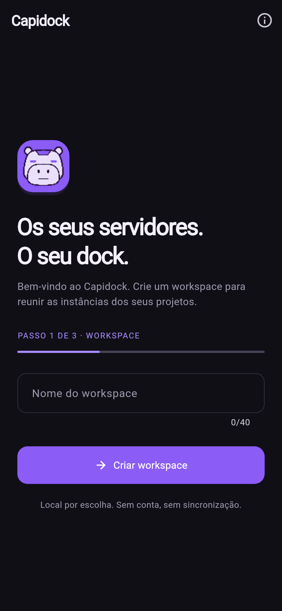
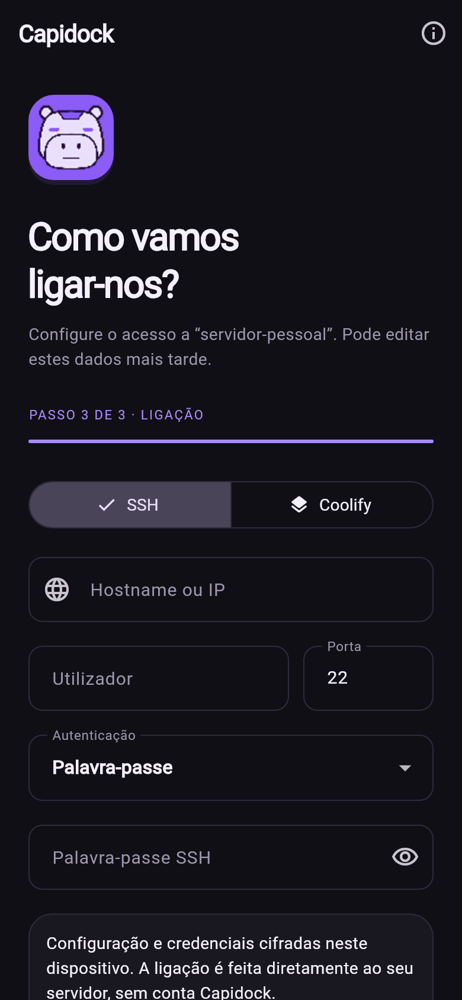
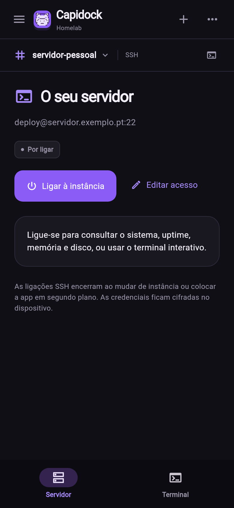

# Capidock

One dock for your servers. A local-first Flutter app for Android with a Portuguese interface, a dark purple theme, and multiple workspaces, each containing its own instances organized as channels.

<p>
  
  
  
</p>

Screenshots rendered from the current Flutter interface. The illustrated address is an example; the app starts with **no workspaces or instances**. [Channel navigation](docs/previews/channels.png).

## Getting started

Requirements: Flutter **3.47.6** / Dart **3.13.5**, JDK 17 or later, a configured Android SDK, and an Android device or emulator. Minimum Android version: **7.0 / API 24**. Application ID: `com.zephyrushq.capidock`.

```sh
flutter pub get
flutter run
```

To validate the project and build an installable development APK:

```sh
dart format --output=none --set-exit-if-changed lib test
flutter analyze
flutter test
flutter build apk --debug
```

APK: `build/app/outputs/flutter-apk/app-debug.apk`.

If `flutter doctor` reports missing `cmdline-tools`, install **Android SDK Command-line Tools** through Android Studio's SDK Manager. Run `flutter doctor --android-licenses` and accept the applicable licenses to finish setting up the environment.

## Automated releases

Every push to `release` triggers validation and publication of a signed APK in a
GitHub Release. Versions increase according to Conventional Commits (`feat`,
`fix`, `BREAKING CHANGE`), and the About dialog displays the installed version.

Signing requires a one-time setup of four GitHub Secrets.
See [setup, versioning, and publishing](docs/releases.md).
Development remains focused on the local app, without a backend or user accounts.

## License, attribution, and trademarks

Copyright © 2026 **ZEPHYRUS PROSPERITY - UNIPESSOAL LDA**.

- [LICENSE](LICENSE): GNU GPL **version 3 only** (`GPL-3.0-only`) for the original
  code and materials covered by the copyright notice. Commercial use,
  modification, and redistribution are permitted subject to GPL obligations,
  including providing corresponding source code when distributing binaries.
- [LICENSE-TRADEMARKS](LICENSE-TRADEMARKS): the policy for the name, logo, and icon.
  Modified distributions must use their own identity as required by the policy
  and applicable law. Truthful references such as “based on Capidock” are
  permitted, and attribution notices must be preserved.
- [COPYRIGHT](COPYRIGHT): the copyright holder, attribution, license scope, and
  third-party notices. This is a notice, not a second software license.

The app is provided **without warranty**, to the extent permitted by law. The GPL
requires change notices in modified versions; these must not be misrepresented
as official releases or modifications made by the company.

All three documents are available offline under **About (`Sobre o Capidock`) →
View licenses (`Ver licenças`) → capidock**, alongside the dependency notices
collected by Flutter. Releases include the documents and a source archive of the
commit used for the build. The policy does not constitute trademark registration;
the AI-generated artwork's provenance is recorded in the
[branding documentation](assets/branding/README.md).

## Current features

- **Workspaces → SSH / Coolify instances**, with a Discord-inspired rail, channel search, moving instances, and workspace management.
- Welcome screen whenever no workspaces exist: name the workspace, name the first instance, then choose and configure SSH or Coolify. Creation is saved atomically; an interrupted setup leaves no partial workspace.
- Encrypted local storage for workspace names, addresses, usernames, passwords, private keys, passphrases, and API tokens. Android uses `flutter_secure_storage` with AES-GCM and an Android Keystore-protected key. No Capidock account, backend, telemetry, or synchronization.
- Real SSH authentication by password or private key (PEM/OpenSSH, including encrypted keys), an interactive PTY terminal, arrow/Tab/Esc/Ctrl keys, and a read-only system summary.
- SSH host-key confirmation on first use; subsequent connections verify the stored fingerprint. A changed key requires explicit verification and replacement.
- Coolify resource listing over HTTPS: application, database, and service names, types, and statuses returned by the API. Refresh and error states use actual responses.
- Timeouts, cancellation, connection errors, empty states, and manual reconnect. No simulated metrics, resources, or terminal responses.
- Responsive layouts, Portuguese UI, a purple theme, and the robot-capybara identity.
- Automated Flutter checks, a loopback SSH transport test, and signed Android release workflows.

## Connect your first server

1. Open the app and choose **Create workspace (`Criar workspace`)**. Enter a workspace name and a name for its first instance.
2. Choose **SSH** and provide a hostname/IP, port (default 22), username, and password or private key. Paste the complete private key including its BEGIN/END lines; enter its passphrase if encrypted.
3. Alternatively, choose **Coolify** and provide its base HTTPS URL, such as `https://coolify.example.com`, and an API token with read permission. Enable API access and allow the phone's network address if the installation uses an IP allowlist. Do not include `/api/v1` in the URL.
4. Save, then tap **Connect (`Ligar à instância`)**. For SSH, compare the displayed SHA256 fingerprint against the server's host key before accepting. Open **Terminal** to interact with the server.

Coolify uses [GET /api/v1/resources](https://coolify.io/docs/api/endpoints/resources/list-resources) with a bearer token. See [API access](https://coolify.io/docs/api/overview). HTTPS must have a certificate trusted by Android; the app does not bypass certificate validation or follow API redirects with credentials.

## Navigation and connection lifecycle

Open the sidebar on your phone. The left rail shows your workspaces; **+** creates another. Selecting a workspace shows its instances. **New instance (`Nova instância`)** adds a channel to that workspace.

Tap the workspace name or **Manage workspaces (`Gerir workspaces`)** to rename or remove a workspace. With at least two workspaces, **⋯ → Move to workspace (`Mover para workspace`)** moves an instance and its credentials together.

Connections start only when you tap **Connect**. SSH sessions close when switching instance, editing its configuration, or putting the app in the background. Terminal output stays in memory for the selected instance (up to 3,000 lines); it is not written to the vault. Reconnect manually when returning. The server summary runs static read-only Linux/POSIX commands (`uname`, `uptime`, `free`, `df`); it is refreshed on connection or on request. Coolify data is a timestamped snapshot refreshed on request.

Coolify management actions (deploy/restart/stop), file transfer, tunnels, keyboard-interactive/MFA SSH, a biometric app lock, and background sessions are not implemented. Encryption protects persisted data; it does not protect a running app on an unlocked or compromised device. Android cloud backup and device transfer are disabled for app data. Uninstalling the app removes its local configuration; there is no export/recovery feature yet.

## Existing installations

The Android application ID is `com.zephyrushq.capidock`, based on the company's primary domain, `zephyrushq.com`. Builds using the former `app.capidock.mobile` ID are separate Android apps: their local workspaces and credentials are not automatically transferred to the new ID.

The encrypted v3 store migrates v1/v2 preferences before opening the app. It removes entries explicitly marked as demos and drops the untouched starter workspace if no real instances remain. Edited examples, user-created instances, renamed workspaces, and intentionally empty custom workspaces are preserved. Legacy instances without credentials prompt you to configure access.

The migration verifies the secure write before removing plaintext preferences. If it fails, the original records remain for retry; unreadable data never triggers an overwrite or a new welcome setup. Secure storage is configured to fail rather than automatically reset on decryption errors.

## Project structure

```text
lib/
  main.dart                         # bootstrap and secure store
  app.dart                          # theme and localization
  core/                             # shared colors and widgets
  features/
    instances/
      domain/                       # configuration and credentials
      presentation/                 # channels and shared connection form
    workspaces/
      domain/                       # models and atomic local changes
      data/                         # encrypted v3 storage and migration
      presentation/                 # welcome, rail, and management
    connections/
      data/                         # SSH, host trust, and Coolify API
      presentation/                 # connection state, terminal, and resources
    workspace/
      workspace_screen.dart         # adaptive navigation and instance actions
```

State uses `ChangeNotifier` and `ListenableBuilder`. No secret is written to shared preferences by the app; shared preferences are read only for migration and removed after verification. The secure-storage plugin manages its own encrypted persistence. See [flutter_secure_storage](https://pub.dev/packages/flutter_secure_storage) and [dartssh2](https://pub.dev/packages/dartssh2).

## Development conventions

Write documentation, code comments, identifiers, test descriptions, and release
notes in **English**. Use `lowerCamelCase` for Dart functions and methods,
`UpperCamelCase` for types, and `snake_case` for Python functions and source file
names. The app's user-facing text currently remains in Portuguese.

See [CONTRIBUTING.md](CONTRIBUTING.md) for naming examples and validation commands.

## Issues, pull requests, and security

Use the [issue templates](https://github.com/zephyrushq/capidock-mobile/issues/new/choose)
for bugs, feature requests, and documentation improvements. Pull requests follow
the [PR template](.github/PULL_REQUEST_TEMPLATE.md) and the branch, naming, and
review guidelines in [CONTRIBUTING.md](CONTRIBUTING.md).

For suspected vulnerabilities, follow [SECURITY.md](SECURITY.md) to arrange a
private report. Do not publish vulnerability details in ordinary issues or PRs.

## Integration validation

`flutter test` covers onboarding, persistence boundaries and migrations, workspace CRUD, API response/error handling, and SSH host-key trust. Native encryption still needs to be checked on Android; memory test doubles do not implement encryption.

A separate loopback SSH test opens real transport sessions, authenticates by password and an encrypted key, reads system information, sends a terminal command, reconnects, and rejects invalid credentials and host keys. CI runs it before producing releases. Run it locally with:

```sh
python3 -m venv /tmp/capidock-ssh-tests
/tmp/capidock-ssh-tests/bin/pip install -r tool/testing/requirements.txt
CAPIDOCK_TEST_PYTHON=/tmp/capidock-ssh-tests/bin/python bash tool/testing/run_ssh_smoke.sh
```

The helper binds only to loopback, creates temporary credentials, permits only its read-only test operations, and cleans up after the run. Coolify HTTP tests use controlled responses; validate with your own Coolify installation before relying on it operationally.

To regenerate the UI previews, set `FLUTTER_ROOT` to your Flutter SDK directory and run `flutter test tool/testing/preview_test.dart`.
